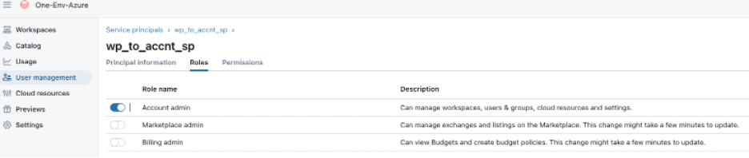
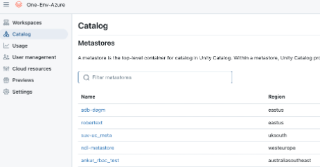
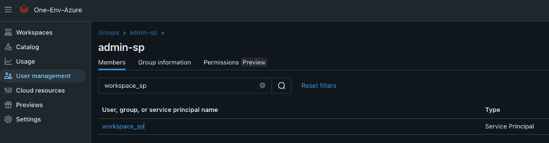
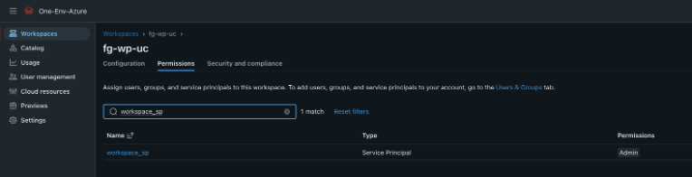
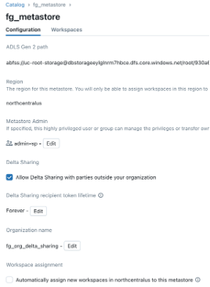
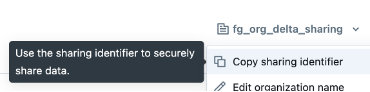
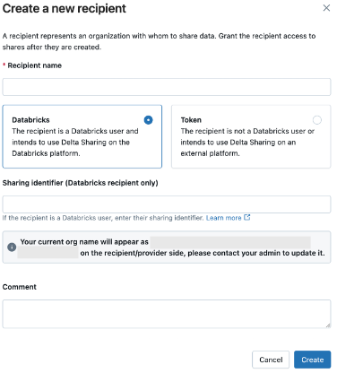
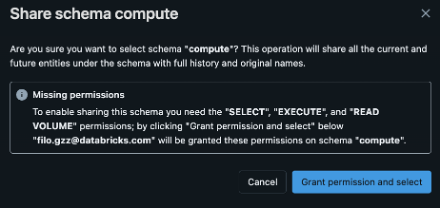
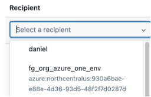
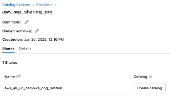

# Center of Governance System -> cog_system
Connect and append system tables from different cloud accounts.
System Tables Requirements

1.	Create a Service Principal on each account with account admin role privileges and access to all the catalogs/metastores inside that account.

- i.	(remember if we want the information to be considered we need to ensure each catalog/metastore shares the system information with the objective catalog)
1.	For this picture example, we would need to run the 1-cog_land_system, and 2-cog_system_dashboard in each catalog a total of 5 times because we have 5 catalogs:

2.	If there is and admin group already associated to each workspace, we can add our “admin account Service Principal” to that admin group:

3.	If step No. 2 was successfully done jump to step 5

4.	The created admin Service Principal needs to be added to the workspace as well as admin:
a.	 

5.	In the account console at the metastore (catalog) level select the “Allow Delta Sharing with parties outside your organization” checkbox for every account required in this solution.
a.	Unselect expiration “Delta Sharing token lifetime”
b.	Give an organization name \
i.  \
ii.	Copy sharing identifier from the workspace in delta sharing UI\
  

6.	Create new recipients in sharing accounts
a.	 

7.	We need to generate cog_land_system catalog because databricks system tables cannot be directly shared.
a.	to achieve this run 1-cog_land_system script (the 0-secret_management script should be run to retrieve the token for the Service Principal with account admin priviliges by creating its scope and storing the key in it).\
b.  Run 2-cog_system_dashboard script to add all the missing metadata required.
c. <b>DO NOT RUN 3-System_Tables_source_of_truth  in satellite accounts.</b>

8.	Create share grants
a.	Add assets
i.	Grant permissions and select each schema to share.
ii.	Missing permissions
1.	To enable sharing this schema, you need the "SELECT,” "EXECUTE,” and "READ VOLUME" permissions; by clicking "Grant permission and selecting" below, "USER@databricks.com will be granted these permissions on schema "SYSTEM_TABLE. “
a.	 \
iii.	Add recipients to share these assets to:\
\
b.	To view and use the data, create a catalog from a share in the <b>core workspace</b>. The data will appear under your account’s shared catalogs.catalog you create <b>MUST have the word "_system"</b> at the end of the name selected.\
 

9.	In the core workspace run 0-secret_management script, 1-cog_land_system, 2-cog_system_dashboard and 3-System_Tables_source_of_truth script, which will merge and append new records only into our CoE system tables.
10. Finish

